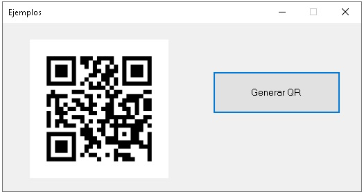

# Ejemplos aplicando librerías de terceros

# #

<details>
<summary>Generación de documentos PDF desde documetos HTML</summary>

### iTextSharp

### SelectPDF

</details>

# #

<details>
<summary>Generación de documentos EXCEL</summary>

### Vista prueba aplicación desktop de prueba

<div align="center">
        
</div>

###  Vista prueba aplicación web de prueba
<div align="center">
        
</div>

###  Usando NPOI (XLS y XLSX)
<div align="center">
        
</div>

###  Usando EPPLUS (XLSX)
<div align="center">
        
</div>

</details>

# #

<details>
<summary> Generación de QR</summary>

### QRCoder
<div align="center">
        
</div>

```csharp
  QRCodeGenerator qrGenerator = new QRCodeGenerator();
  QRCodeData qrCodeData = qrGenerator.CreateQrCode(data, QRCodeGenerator.ECCLevel.Q);
  QRCode qrCode = new QRCode(qrCodeData);
  Bitmap qrCodeImage = qrCode.GetGraphic(sizeModulo);
```

</details>


