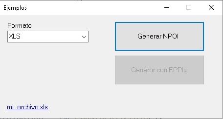
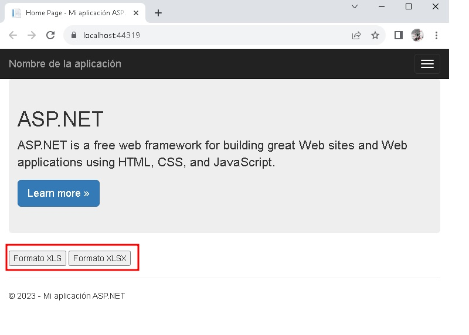
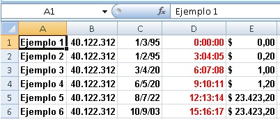
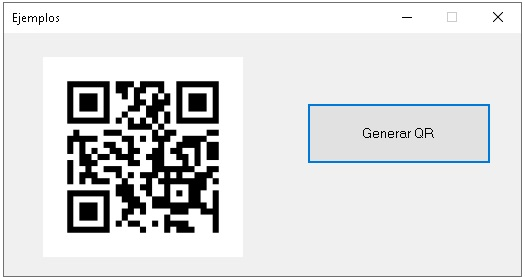

# Ejemplos aplicando librerías de terceros


### Generación de documentos PDF desde documetos HTML
<details>
<summary>Ver</summary>

### iTextSharp

### SelectPDF

</details>


### Generación de documentos EXCEL
<details>
<summary>Ver</summary>

<details>
<summary>Vista prueba aplicación desktop de prueba</summary>
 
<div align="center">
        
</div>
</details>


<details>
<summary>Vista prueba aplicación web de prueba</summary>

<div align="center">
        
</div>

```csharp
        protected void btnXLS_Click(object sender, EventArgs e)
        {
            try
            {
                GenerarExcelNPOI generador = new GenerarExcelNPOI();

                byte[] bytes = generador.GenerarExcel(GenerarExcelNPOI.TipoFormato.XLS);
                string mimeType = generador.GetMimeType(GenerarExcelNPOI.TipoFormato.XLS);

                var fileName = "ejemplo.xls";
                HttpResponse response = HttpContext.Current.Response;
                response.Clear();
                response.ContentType = mimeType;
                response.AddHeader("Content-Disposition", $"attachment;filename=\"{fileName}\"");

                var memoryStream = new MemoryStream();
                memoryStream.Write(bytes,0,bytes.Length);
                memoryStream.Seek(0, SeekOrigin.Begin);
                memoryStream.CopyTo(Response.OutputStream);
                response.End();
            }
            catch (Exception ex)
            {
                lbError.Text = ex.Message;
            }
        }
```

```csharp
         protected void btnXLSX_Click(object sender, EventArgs e)
        {
            try
            {
                GenerarExcelNPOI generador = new GenerarExcelNPOI();
                byte[] bytes = generador.GenerarExcel(GenerarExcelNPOI.TipoFormato.XLSX);
                string mimeType = generador.GetMimeType(GenerarExcelNPOI.TipoFormato.XLSX);

                var fileName = "ejemplo.xlsx";
                HttpResponse response = HttpContext.Current.Response;
                response.Clear();
                response.ContentType = mimeType;
                response.AddHeader("Content-Disposition", $"attachment;filename=\"{fileName}\"");

                var memoryStream = new MemoryStream();
                memoryStream.Write(bytes, 0, bytes.Length);
                memoryStream.Seek(0, SeekOrigin.Begin);
                memoryStream.CopyTo(Response.OutputStream);
                response.End();
            }
            catch (Exception ex)
            {
                lbError.Text = ex.Message;
            }
        }
```
</details>

# #

<details>
<summary>Vista prueba aplicación Web API de prueba</summary>


</details>

# #        
        
###  Usando NPOI (XLS y XLSX)
<div align="center">
        
</div>

###  Usando EPPLUS (XLSX)
<div align="center">
        
</div>

</details>


### Generación de QR
<details>
<summary>Ver</summary>

### QRCoder

<div align="center">
        
 <p>Ejemplo 1.</p>
</div>

```csharp
  QRCodeGenerator qrGenerator = new QRCodeGenerator();
  QRCodeData qrCodeData = qrGenerator.CreateQrCode(data, QRCodeGenerator.ECCLevel.Q);
  QRCode qrCode = new QRCode(qrCodeData);
  Bitmap qrCodeImage = qrCode.GetGraphic(sizeModulo);
```
<div align="center">
         <p>Ejemplo 2. Copia a portapeles</p>
</div>

<div align="center">
        
 <p>Ejemplo 3.  Copia a portapeles, Colores e icono.</p>
</div>


</details>


