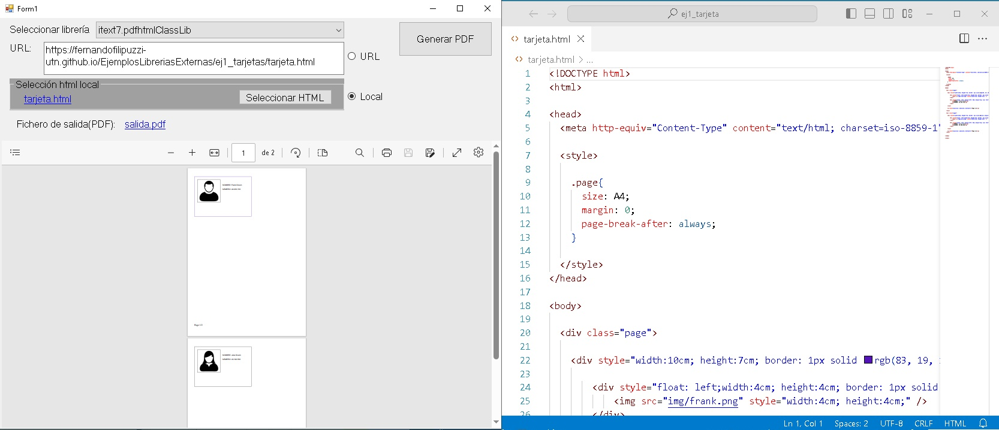
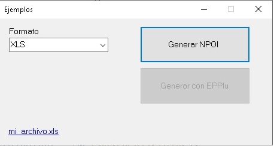
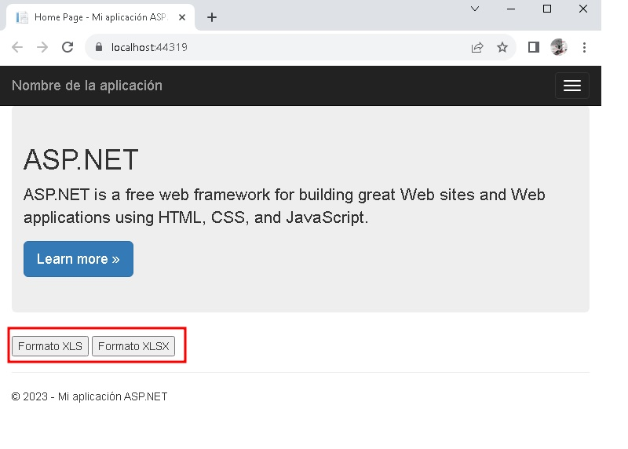
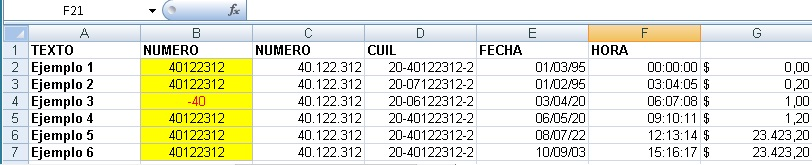
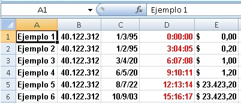
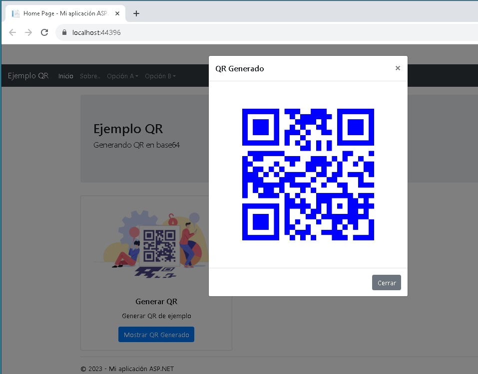

# Ejemplos aplicando librerías de terceros


### Generación de documentos PDF desde documetos HTML
<details>
<summary>Ver</summary>
<details>
<summary>Vista prueba aplicación desktop de prueba</summary>

La aplicación de prueba se muestra en la siguiente figura, permite ir editando con otro editor como Visual Studio Code e ir regenerando el pdf para ver como va quedando.
<div align="center">
        
        <p>Figura 1. A la izquierda la aplicación de prueba, a la derecha Visual Studio Code</p>
</div>

</details>

### itext7.pdfhtml

```csharp
        public void GenerarPDFFromHTML(string PathHtml, string PathPdf)
        {
            using (FileStream htmlSource = File.Open(PathHtml, FileMode.Open))
            using (FileStream pdfDest = File.Open(PathPdf, FileMode.Create))
            {
                ConverterProperties properties = new ConverterProperties();
                properties.SetBaseUri(Path.GetDirectoryName(PathHtml));
                HtmlConverter.ConvertToPdf(htmlSource, pdfDest, properties);
            }
        }
```

### SelectPDF

```csharp
        public void GenerarPDFFromHTML(string PathHtml,string PathPdf)
        {
            HtmlToPdf converter = new HtmlToPdf();

            PdfDocument doc = converter.ConvertUrl(PathHtml);

            doc.Save(PathPdf);
            doc.Close();
        }
```


</details>


### Generación de documentos EXCEL
<details>
<summary>Ver</summary>

<details>
<summary>Vista prueba aplicación desktop de prueba</summary>
 
<div align="center">
        
</div>
</details>


<details>
<summary>Vista prueba aplicación web de prueba</summary>

<div align="center">
        
</div>

```csharp
        protected void btnXLS_Click(object sender, EventArgs e)
        {
            try
            {
                GenerarExcelNPOI generador = new GenerarExcelNPOI();

                byte[] bytes = generador.GenerarExcel(GenerarExcelNPOI.TipoFormato.XLS);
                string mimeType = generador.GetMimeType(GenerarExcelNPOI.TipoFormato.XLS);

                var fileName = "ejemplo.xls";
                HttpResponse response = HttpContext.Current.Response;
                response.Clear();
                response.ContentType = mimeType;
                response.AddHeader("Content-Disposition", $"attachment;filename=\"{fileName}\"");

                var memoryStream = new MemoryStream();
                memoryStream.Write(bytes,0,bytes.Length);
                memoryStream.Seek(0, SeekOrigin.Begin);
                memoryStream.CopyTo(Response.OutputStream);
                response.End();
            }
            catch (Exception ex)
            {
                lbError.Text = ex.Message;
            }
        }
```

```csharp
         protected void btnXLSX_Click(object sender, EventArgs e)
        {
            try
            {
                GenerarExcelNPOI generador = new GenerarExcelNPOI();
                byte[] bytes = generador.GenerarExcel(GenerarExcelNPOI.TipoFormato.XLSX);
                string mimeType = generador.GetMimeType(GenerarExcelNPOI.TipoFormato.XLSX);

                var fileName = "ejemplo.xlsx";
                HttpResponse response = HttpContext.Current.Response;
                response.Clear();
                response.ContentType = mimeType;
                response.AddHeader("Content-Disposition", $"attachment;filename=\"{fileName}\"");

                var memoryStream = new MemoryStream();
                memoryStream.Write(bytes, 0, bytes.Length);
                memoryStream.Seek(0, SeekOrigin.Begin);
                memoryStream.CopyTo(Response.OutputStream);
                response.End();
            }
            catch (Exception ex)
            {
                lbError.Text = ex.Message;
            }
        }
```
</details>

# #

<details>
<summary>Vista prueba aplicación Web API de prueba</summary>


</details>

# #        
        
###  Usando NPOI (XLS y XLSX)
<div align="center">
        
</div>

###  Usando EPPLUS (XLSX)
<div align="center">
        
</div>

</details>


### Generación de QR
<details>
<summary>Ver</summary>

### QRCoder
# #
#### Ejemplo 1. Desktop

<div align="center">
        
       <p>Ejemplo 1. Windows Form</p>
</div>

```csharp
  QRCodeGenerator qrGenerator = new QRCodeGenerator();
  QRCodeData qrCodeData = qrGenerator.CreateQrCode(data, QRCodeGenerator.ECCLevel.Q);
  QRCode qrCode = new QRCode(qrCodeData);
  Bitmap qrCodeImage = qrCode.GetGraphic(sizeModulo);
```
# #
#### Ejemplo 1. Web

<div align="center">
        
        <p>Ejemplo 1. Web. Generando QR en base 64</p>
</div>

```csharp
        protected void Page_Load(object sender, EventArgs e)
        {
            if (!IsPostBack)
            {
                string base64Image = GenerarQR("valor de prueba");
                imgQR.ImageUrl = "data:image/png;base64," + base64Image;
            }
        }
        private string GenerarQR(string data)
        {
            QRCodeGenerator qrGenerator = new QRCodeGenerator();
            QRCodeData qrCodeData = qrGenerator.CreateQrCode(data, QRCodeGenerator.ECCLevel.Q);
            
            Base64QRCode qrCode = new Base64QRCode(qrCodeData);
            string qrCodeImageAsBase64 = qrCode.GetGraphic(20, Color.Blue, Color.Transparent, true);
            return qrCodeImageAsBase64;
        }
```
# #
#### Ejemplo 2. Windows Form

<div align="center">
         <p>Ejemplo 2. Copia a portapeles</p>
</div>

# #
#### Ejemplo 3. Windows Form

<div align="center">
        
 <p>Ejemplo 3.  Copia a portapeles, Colores e icono.</p>
</div>


</details>


